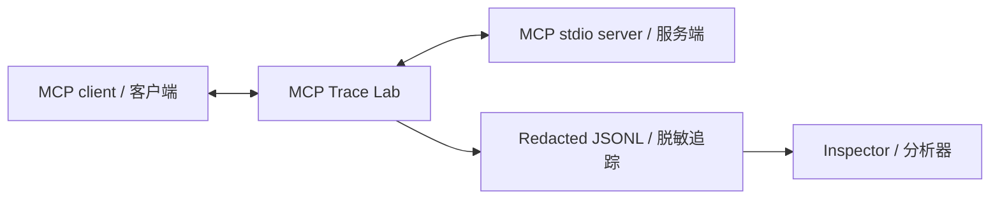

# Architecture / 架构

## System context / 系统上下文

MCP Trace Lab is a transparent local process inserted between an MCP client and an existing stdio server. It owns no business logic and makes no network calls.

MCP Trace Lab 是插入 MCP 客户端与现有 stdio 服务端之间的透明本地进程。它不承载业务逻辑，也不会主动发起网络请求。

## Components / 组件

| Component / 组件 | Responsibility / 职责                                                                         | Boundary / 边界                                                        |
| ---------------- | --------------------------------------------------------------------------------------------- | ---------------------------------------------------------------------- |
| CLI              | Validate commands and keep user diagnostics on stderr / 校验命令并将诊断限制在 stderr         | Never writes diagnostics to protocol stdout / 不向协议 stdout 输出诊断 |
| Forwarder        | Move bytes in both directions and honor destination backpressure / 双向传输字节并遵守目标背压 | Does not parse before forwarding / 转发不依赖解析结果                  |
| Line observer    | Reassemble newline-delimited UTF-8 messages / 重组按换行分隔的 UTF-8 消息                     | Observes a copy of the forwarded bytes / 仅观察转发字节副本            |
| Recorder         | Classify, correlate, redact, and append trace events / 分类、关联、脱敏并追加追踪事件         | Invalid raw payloads are never persisted / 不持久化无效消息原文        |
| Inspector        | Aggregate one or more recorded sessions / 聚合一个或多个已记录会话                            | Read-only; never executes captured content / 只读且不执行捕获内容      |

## Data flow / 数据流

1. The client byte chunk is written to the upstream server without transformation.  
   客户端字节块不经转换写入上游服务端。
2. A copy enters the UTF-8 line observer. Complete lines are classified as JSON-RPC 2.0.  
   字节副本进入 UTF-8 行观察器，完整行按 JSON-RPC 2.0 分类。
3. Valid messages are recursively redacted before JSONL persistence.  
   有效消息在写入 JSONL 前递归脱敏。
4. Requests are indexed by direction, ID type, and ID value. The opposite-direction response closes the pending request and receives method, tool name, and duration metadata.  
   请求按方向、ID 类型和值建立索引；反方向响应结束待处理请求，并继承方法、工具名及耗时元数据。
5. Server stdout follows the same process in reverse. Server stderr is forwarded to recorder stderr and is not persisted.  
   服务端 stdout 以相反方向执行同一流程；服务端 stderr 转发到记录器 stderr，但不落盘。

## Reliability choices / 可靠性设计

### Protocol transparency / 协议透明

Forwarding is independent from parsing. A malformed JSON line is still delivered byte-for-byte. This avoids turning an observability failure into a protocol behavior change.

转发与解析相互独立。即使某行 JSON 无法解析，也会逐字节送达，避免把可观测性故障变成协议行为变化。

### Backpressure / 背压

Each source pauses when either the protocol destination or trace file reaches its high-water mark. It resumes only after all blocked destinations drain. This bounds memory growth during bursts.

当协议目标或追踪文件任一达到高水位时，源流会暂停；所有受阻目标排空后才恢复，从而限制突发流量下的内存增长。

### Lifecycle / 生命周期

Client EOF closes upstream stdin. `SIGINT` and `SIGTERM` are forwarded to the wrapped server. The recorder waits for the server process and closes the trace stream before returning its exit status.

客户端 EOF 会关闭上游 stdin；`SIGINT` 与 `SIGTERM` 会传递给被包装服务。记录器等待服务进程结束，并在返回退出状态前关闭追踪流。

## Dependency strategy / 依赖策略

The runtime intentionally uses only Node.js built-ins. It does not need the MCP SDK because it acts as a transport-level proxy rather than an MCP client or server implementation. Development dependencies provide static analysis, formatting, TypeScript execution in tests, and compilation.

运行时刻意只使用 Node.js 内置模块。该工具是传输层代理，而不是 MCP 客户端或服务端实现，因此不需要 MCP SDK。开发依赖仅用于静态分析、格式化、测试中的 TypeScript 执行和编译。

## Scope decisions / 范围决策

Not included in `v0.1` / `v0.1` 暂不包含：

- Streamable HTTP interception / Streamable HTTP 拦截
- Remote trace storage or telemetry / 远程追踪存储或遥测
- Full-text search and Web UI / 全文搜索与 Web UI
- Payload schema inference / 载荷 Schema 推断

These features remain outside the MVP until stdio correctness and the trace contract are stable.

在 stdio 正确性和追踪契约稳定前，这些功能不进入 MVP。
